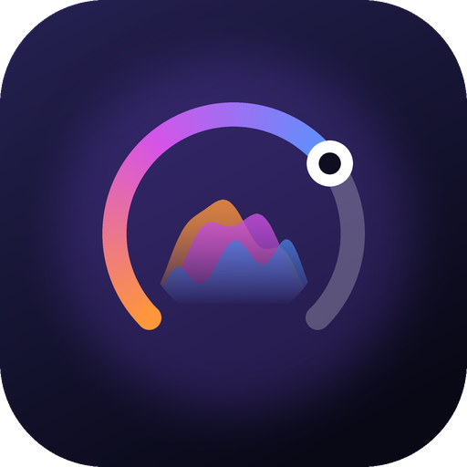

<div align="center">



# Cadence

**A gesture-driven gym timer for Android that rides your music.**

Stopwatch and countdown on one calm screen. Whatever you're playing, in any music app, shows up
around the timer with its artwork and a waveform that moves with the beat.

[](https://github.com/sultanmaliki/cadence-timer/releases)
[](LICENSE)


</div>

---

## Why

Most timer apps are a timer with a music widget bolted on. Cadence is the other way around: **the
timer is not the interface, the media is.** The screen belongs to your music; the timer is a quiet
layer on top of it, and you run everything with gestures so you never have to aim at a button
mid-set.

<div align="center">

<br />
<sub>The wave follows the low, mid and high sounds of whatever is playing, live. Timer underneath.</sub>
</div>

## Features

- **Now playing companion.** Shows the title, artist, album, artwork and progress of what any music
  app is playing (built and tested with Mi Music), in a One UI-style player. The music keeps
  playing in its own app, so it works with the screen off.
- **Beat-reactive wave.** A colour-graded waveform, tinted from the artwork, that reacts to bass,
  mids and highs in real time. It goes completely idle when paused.
- **Gesture control.** Seek, scrub, play/pause and skip tracks in the source app without looking.
- **Stopwatch and countdown.** Accurate across sleep, restored after the app is killed, with a
  **background alarm** that rings even when the screen is off.
- **Local media too.** Play your own videos and audio files with playlists, in their native aspect
  ratio, with the timer drawn as a *negative* effect that inverts against the picture.
- **Private by design.** No internet permission, no accounts, no analytics, no cloud.

<div align="center">

<br />
<sub>Local video mode: the timer inverts against the picture underneath it.<br />
Sample footage: <i>Big Buck Bunny</i> © Blender Foundation, <a href="https://peach.blender.org">peach.blender.org</a>, CC BY 3.0.</sub>
</div>

## Gestures

| Gesture | Action |
|---|---|
| Tap the centre | Start / pause the timer |
| Hold the timer for ~0.8 s (while paused) | Reset, with a growing ring |
| Double-tap left / right third | Seek back / forward 10 s |
| Drag horizontally | Scrub the track |
| Two-finger tap | Play / pause the music |
| Two-finger swipe | Previous / next track |
| Tap top-left | Stopwatch or countdown |
| Tap top-right | Now playing / choose a file / playlists |

## Install

1. Download the newest `.apk` from the
   [**Releases**](https://github.com/sultanmaliki/cadence-timer/releases) page and open it on your
   phone. Android will ask you to allow installs from your browser or file manager.
2. Open Cadence and follow the card that appears: it asks for **notification access** so it can see
   what's playing. On some phones Android says *Restricted setting*; open Cadence's App info, tap
   ⋮ and choose *Allow restricted settings*, then try again.
3. Optional: allow **Record audio** when offered to switch on the beat-reactive wave (see below).

Cadence needs Android 10 or newer. Release builds are signed with a debug key for sideloading, so
an update installs over the previous one only if it uses the same key; if Android refuses, uninstall
first.

## What it asks for, and why

| Permission | Used for | Notes |
|---|---|---|
| Notification access | Reading what other apps are playing (title, artwork, progress) and controlling them | Reads **media sessions only**. It never reads your notifications. |
| Record audio (+ Modify audio settings) | Android's audio visualizer, to measure low/mid/high loudness for the wave | Optional. The microphone is **not** used; nothing is recorded, stored or sent. Android simply gates the visualizer behind this permission. |
| Exact alarms, boot completed | Ringing when a countdown ends, and re-arming it after a reboot | |
| Notifications | The "Time's up" alert | Asked when you pick a countdown. |

There is no internet permission at all.

## Build from source

You need Android Studio (its bundled JDK is fine) and an Android SDK; the Gradle wrapper does the
rest.

```bash
./gradlew assembleDebug           # debug APK in app/build/outputs/apk/debug
./gradlew testDebugUnitTest       # 100+ JVM unit tests
./gradlew lintDebug
```

There are also 18 on-device gesture tests that drive the real gesture engine on a phone. See
[`CONTRIBUTING.md`](CONTRIBUTING.md) for how to run them safely (Gradle's own connected-test task
uninstalls the app afterwards).

The stack is Kotlin, Jetpack Compose and Media3, with a small hand-written gesture engine. The
package id is still `dev.fitnesstimer` (the app was called *Fitness Timer* before it was renamed),
so that upgrades keep working.

## Project status

Built and hardened on a single phone (Xiaomi, HyperOS 3.0, Android 16) with Mi Music as the source.
Gestures in companion mode were confirmed by hand.

Not yet verified: the countdown notification's sound on a fresh permission grant, rescheduling after
a reboot, other music apps (YouTube Music, Spotify and friends may publish less metadata), and other
phones. The audio visualizer is known to vary by device, so Cadence shows a faint idle ripple rather
than faking beats when it can't get audio.

Playing YouTube links inside the app was researched and deliberately not built: YouTube's policies
forbid overlays and background or audio-only playback on embedded players. Cadence controls the
YouTube Music app instead.

## Documentation

- [`PLAN.md`](PLAN.md): the technical plan and the reasoning behind every major decision, with what
  was verified on a device and what was not.
- [`STRUCTURE.md`](STRUCTURE.md): the code layout.
- [`DECISIONS.md`](DECISIONS.md): decisions made and questions still open.
- [`test-logs/`](test-logs): saved test and device run logs.

## Contributing

Issues and pull requests are welcome; see [`CONTRIBUTING.md`](CONTRIBUTING.md).

## License

[Apache License 2.0](LICENSE). Copyright 2026 Sultan Maliki.
