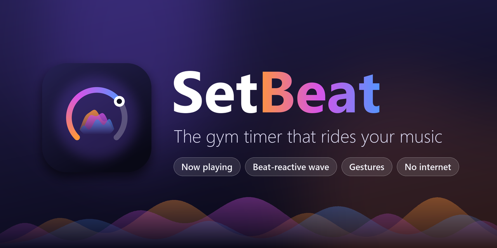
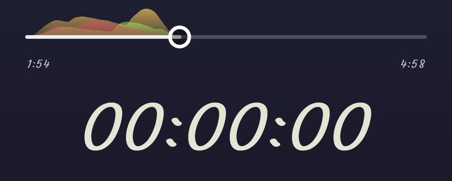
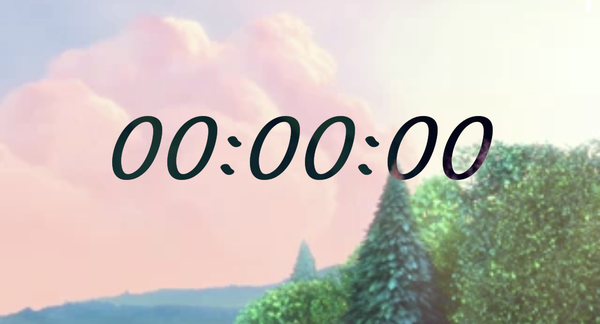

<div align="center">



**A gesture-driven gym timer for Android that rides your music.**

Stopwatch and countdown on one calm screen. Whatever you're playing, in any music app, shows up
around the timer with its artwork and a waveform that moves with the beat.

[](https://github.com/sultanmaliki/setbeat/releases)
[](LICENSE)


</div>

---

## Why

Most timer apps are a timer with a music widget bolted on. SetBeat is the other way around: **the
timer is not the interface, the media is.** The screen belongs to your music; the timer is a quiet
layer on top of it, and you run everything with gestures so you never have to aim at a button
mid-set.

<div align="center">

<br />
<sub>The wave follows the low, mid and high sounds of whatever is playing, live. Timer underneath.</sub>
</div>

## Features

- **Now playing companion.** Shows the title, artist, album, artwork and progress of what any music
  app is playing (built and tested with Mi Music), in a One UI-style player. The music keeps
  playing in its own app, so it works with the screen off.
- **Beat-reactive wave.** A colour-graded waveform, tinted from the artwork, that reacts to bass,
  mids and highs in real time. It goes completely idle when paused.
- **Gesture control.** Seek, scrub, play/pause and skip tracks in the source app without looking.
- **Stopwatch and countdown.** Accurate across sleep, restored after the app is killed, with a
  **background alarm** that rings even when the screen is off.
- **Local media too.** Play your own videos and audio files with playlists, in their native aspect
  ratio, with the timer drawn as a *negative* effect that inverts against the picture.
- **Private by design.** No internet permission, no accounts, no analytics, no cloud.

<div align="center">

<br />
<sub>Local video mode: the timer inverts against the picture underneath it.<br />
Sample footage: <i>Big Buck Bunny</i> © Blender Foundation, <a href="https://peach.blender.org">peach.blender.org</a>, CC BY 3.0.</sub>
</div>

## Gestures

| Gesture | Action |
|---|---|
| Tap the centre | Start / pause the timer |
| Hold the timer for ~0.8 s (while paused) | Reset, with a growing ring |
| Double-tap left / right third | Seek back / forward 10 s |
| Drag horizontally | Scrub the track |
| Two-finger tap | Play / pause the music |
| Two-finger swipe | Previous / next track |
| Tap top-left | Stopwatch or countdown |
| Tap top-right | Now playing / choose a file / playlists |

## Install

SetBeat comes in **two editions** from the [Releases](https://github.com/sultanmaliki/setbeat/releases)
page. Pick by what you need:

| Edition | Download | What you get | Where it installs |
|---|---|---|---|
| **Standalone** | `setbeat-standalone-vX.Y.Z.apk` | Stopwatch and countdown, gestures, local video and audio with the negative-blend timer, playlists, background countdown alarm | **Any phone**, straight from your browser or a file manager |
| **Full** | `setbeat-full-vX.Y.Z.apk` | Everything in Standalone **plus** companion mode (shows and controls what other music apps play) and the beat-reactive wave | Needs one extra step on some phones, see below |

**Standalone:** download, open, allow installs from your browser or file manager, done. It asks for
no sensitive permissions.

**Full:** open it, and follow the card that appears. It asks for **notification access** so it can see
what's playing. On some phones Android says *Restricted setting*; open SetBeat's App info, tap ⋮ and
choose *Allow restricted settings*, then try again. Optionally allow **Record audio** when offered to
switch on the beat wave (see below).

### "App blocked to protect your device" (Google Play Protect)

If you try to install the **Full** edition and Google Play Protect says *"This app can request access
to sensitive data"* with only an **OK** button, that is not a bug and not malware detection. In some
markets (Google has piloted it in India, Singapore, Thailand and Brazil), Play Protect automatically
blocks apps installed from a browser, messaging app or file manager if they ask for one of four
sensitive permissions: reading SMS, accessibility control, or **notification access**. Fraud apps abuse
those to steal one-time passwords. SetBeat's companion mode needs notification access (it is the only
way Android lets an app see what another app is playing), and it only reads media playback info.

What you can do:
- **Install the Standalone edition instead.** It does not declare any of those permissions, so Play
  Protect does not block it.
- Install the Full edition with `adb` from a computer (Play Protect's block applies to installs from
  browsers, messaging apps and file managers): `adb install setbeat-full-vX.Y.Z.apk`.
- Pausing Play Protect's scanning lets the install through, but it lowers your phone's protection while
  paused, so we do not recommend it.
- A Google Play listing would avoid the block entirely; it is not published there yet.

### Verify the download
Releases are signed with SetBeat's own key. To check that an APK is genuine, its signing certificate's
SHA-256 fingerprint must be:

```
23:79:00:8C:6B:C1:D0:15:77:63:FD:A5:D3:23:4B:51:3E:A5:78:55:1E:A9:5E:5D:8E:3B:17:5D:13:DF:B8:6A
```

(`apksigner verify --print-certs setbeat-standalone-vX.Y.Z.apk` prints it as lowercase hex without
colons.) Each release also lists the SHA-256 checksum of every APK. **Upgrading note:** versions before
0.3.0 were signed with a shared debug key; Android will not update across a signing-key change, so if
the install is refused, uninstall the old version first (its playlists and timer are removed).

SetBeat needs Android 10 or newer.

## What it asks for, and why

| Permission | Used for | Notes |
|---|---|---|
| Notification access | Reading what other apps are playing (title, artwork, progress) and controlling them | **Full edition only.** Reads **media sessions only**. It never reads your notifications. |
| Record audio (+ Modify audio settings) | Android's audio visualizer, to measure low/mid/high loudness for the wave | **Full edition only**, optional. The microphone is **not** used; nothing is recorded, stored or sent. Android simply gates the visualizer behind this permission. |
| Exact alarms, boot completed | Ringing when a countdown ends, and re-arming it after a reboot | Both editions. |
| Notifications | The "Time's up" alert | Both editions. Asked when you pick a countdown. |

There is no internet permission at all. The Standalone edition has none of the permissions above
marked "Full edition only".

## Build from source

You need Android Studio (its bundled JDK is fine) and an Android SDK; the Gradle wrapper does the
rest.

```bash
./gradlew assembleFullDebug assembleStandaloneDebug   # debug APKs in app/build/outputs/apk/<edition>/debug
./gradlew testFullDebugUnitTest testStandaloneDebugUnitTest   # 100+ JVM unit tests
./gradlew lintFullDebug lintStandaloneDebug
./gradlew assembleFullRelease assembleStandaloneRelease       # release APKs
```

Release builds are signed with a private key read from a gitignored `keystore.properties`; without it
(a fresh clone) they fall back to the debug key so they still build.

There are also 30 on-device tests that drive the real gesture engine and the whole timer flow on a phone. See
[`CONTRIBUTING.md`](CONTRIBUTING.md) for how to run them safely (Gradle's own connected-test task
uninstalls the app afterwards).

The stack is Kotlin, Jetpack Compose and Media3, with a small hand-written gesture engine. The
package id is still `dev.fitnesstimer` (the app was called *Fitness Timer*, then *Cadence*, before it became SetBeat),
so that upgrades keep working.

## Project status

Built and hardened on a single phone (Xiaomi, HyperOS 3.0, Android 16) with Mi Music as the source.
Gestures and the timer/stopwatch flows are covered by 30 on-device tests; gestures in companion mode
were also confirmed by hand. Local playback stays alongside companion mode.

Not yet verified: the countdown notification's sound on a fresh permission grant, rescheduling after
a reboot, other music apps (YouTube Music, Spotify and friends may publish less metadata), and other
phones. The audio visualizer is known to vary by device, so SetBeat shows a faint idle ripple rather
than faking beats when it can't get audio.

Playing YouTube links inside the app was researched and deliberately not built: YouTube's policies
forbid overlays and background or audio-only playback on embedded players. SetBeat controls the
YouTube Music app instead.

## Documentation

- [`PLAN.md`](PLAN.md): the technical plan and the reasoning behind every major decision, with what
  was verified on a device and what was not.
- [`STRUCTURE.md`](STRUCTURE.md): the code layout.
- [`CHANGELOG.md`](CHANGELOG.md): what changed in each release.
- [`DECISIONS.md`](DECISIONS.md): decisions made and questions still open.
- [`test-logs/`](test-logs): saved test and device run logs.

## Contributing

Issues and pull requests are welcome; see [`CONTRIBUTING.md`](CONTRIBUTING.md).

## License

[Apache License 2.0](LICENSE). Copyright 2026 Sultan Maliki.
